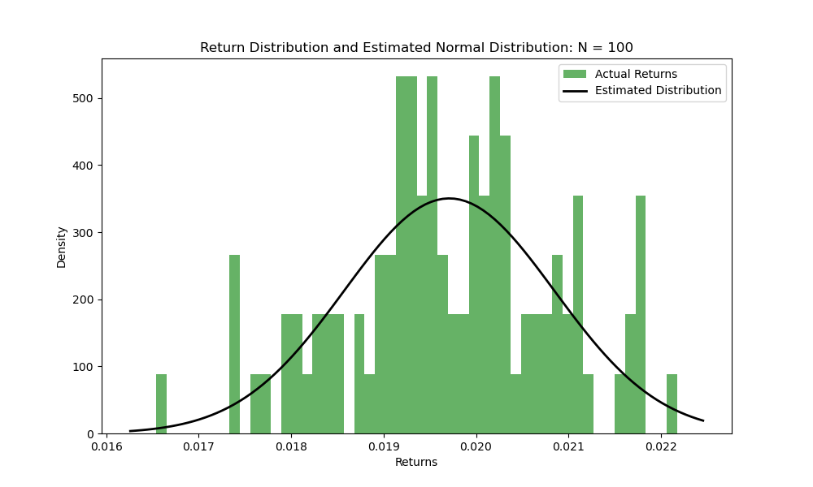
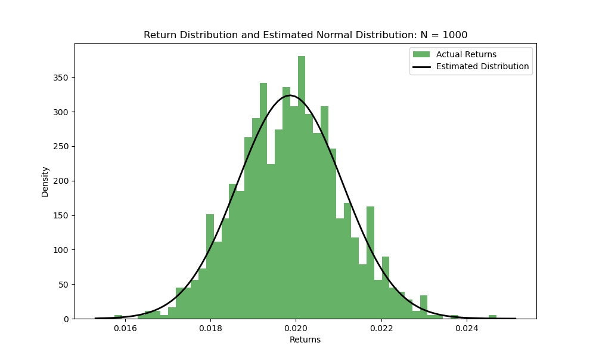
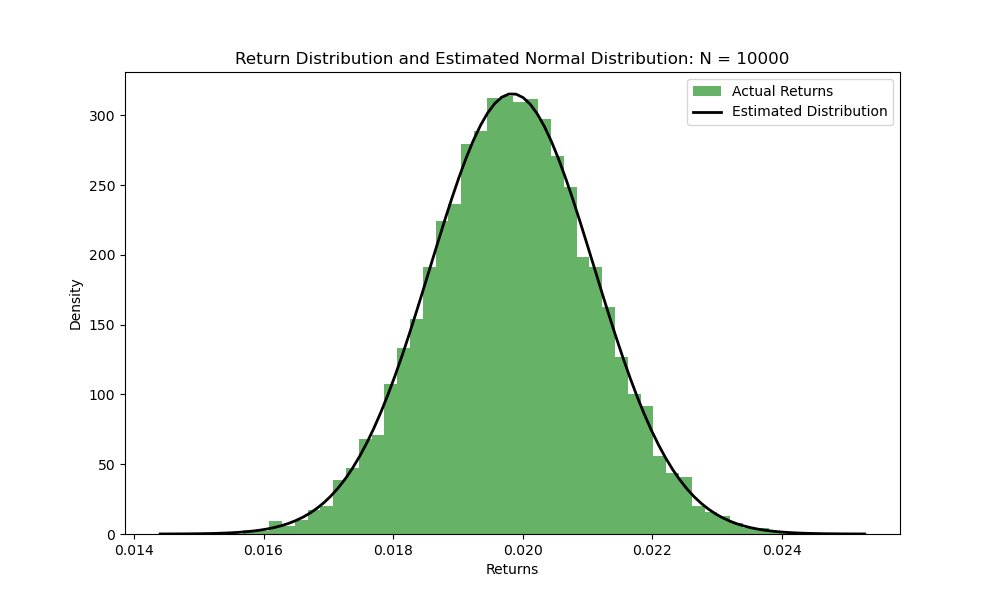
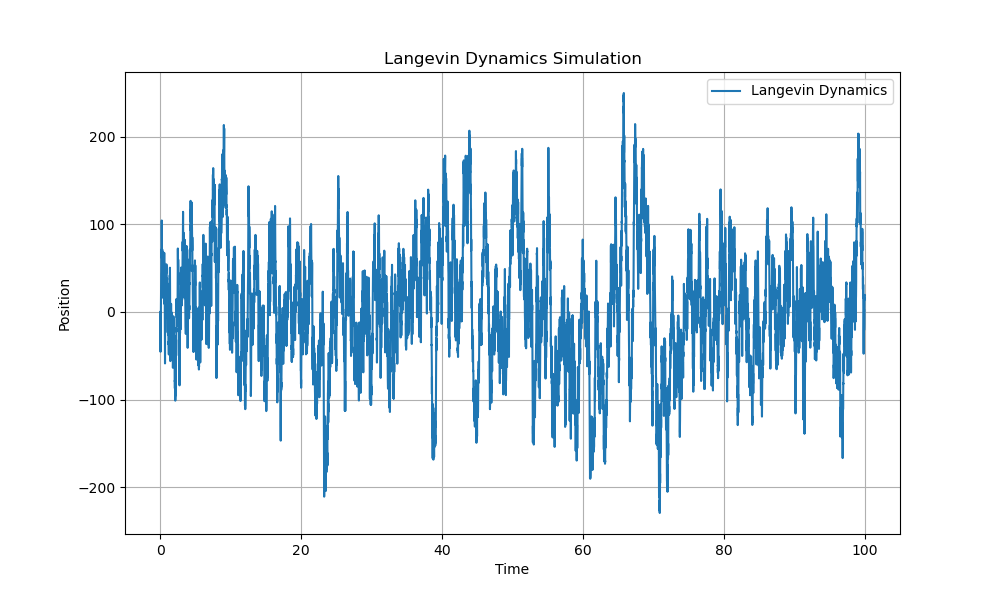

# particles

This repository contains Python implementations and simulations related to the Fokker-Planck equation and Langevin dynamics, two fundamental mathematical frameworks for modeling stochastic processes in physics, chemistry, finance, and machine learning.

## Fokker-Planck Equation 1d Simulation

See `notebooks/fokker_planck_equation_1d_simulation.ipynb` for a simulation of the `Fokker-Planck equation` in 1d.

The Fokker-Planck equation is given by:

$$
\frac{\partial P(x, t)}{\partial t} = -\frac{\partial}{\partial x} [A(x) P(x, t)] + \frac{\partial^2}{\partial x^2} [B(x) P(x, t)]
$$

- where $( P(x, t) )$ is the probability density function
- $( A(x) )$ is the drift coefficient.
- $( B(x) )$ is the diffusion coefficient.

```python
    # define negative log likelihood function
    def negative_log_likelihood(params, data, dt):
        mu, sigma = params
        returns = data['Return'].values
        N = len(returns)
        nll = 0.5 * N * np.log(2 * np.pi * sigma**2 * dt) + \
            np.sum((returns - mu * dt)**2) / (2 * sigma**2 * dt)
        return nll

    # set initial parameters and bounds
    initial_params = [0.0, 0.01]
    bounds = [(-np.inf, np.inf), (1e-6, np.inf)]

    # optimize negative log likelihood function
    result = minimize(
        negative_log_likelihood, 
        initial_params, 
        args=(data, dt), 
        bounds=bounds, 
        method='L-BFGS-B'
    )
    estimated_mu, estimated_sigma = result.x
```

<p align="center">
    
</p>

<p align="center">
    
</p>

<p align="center">
    
</p>

## Langevin Dynamics 1d Simulation

See `notebooks/langevin_dynamics_1d_simulation.ipynb` for a simulation of `Langevin dynamics` in 1d.

The Langevin equation is given by:

$$
m \frac{d^2 x}{dt^2} = -\gamma \frac{dx}{dt} + F(x) + \eta(t),
$$

where:

- $m$: mass of the particle
- $\gamma$: friction coefficient
- $F(x)$: force derived from the external potential $(F(x) = -\nabla U(x))$
- $\eta(t)$: Gaussian white noise with mean 0 and $\langle \eta(t) \eta(t{\prime}) \rangle = 2\gamma k_B T \delta(t - t{\prime})$.

<p align="center">
    
</p>